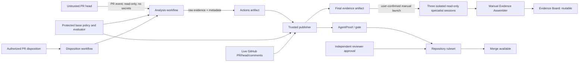

# Architecture

## Goal and trust statement

AgentProof evaluates a bounded statement for one repository, policy version,
and pull-request head SHA: configured evidence and dispositions satisfy the
selected policy. Enforced repository rules and a distinct human reviewer
separately govern merge; an evidence artifact is not an approval or a merge.

It does **not** prove universal authorship, security, privacy, legal compliance,
or production fitness.

## Components

| Layer                    | Component                                                 | Responsibility                                                                                                                              |
| ------------------------ | --------------------------------------------------------- | ------------------------------------------------------------------------------------------------------------------------------------------- |
| Subject                  | Synthetic expense API and PR                              | Untrusted code and declared origin under review.                                                                                            |
| Collection               | `@agentproof/evidence-cli` collectors                     | Run tests/coverage, dependency audit, retention validation, and origin parsing; normalize failures as findings.                             |
| Contract                 | `@agentproof/evidence-core`                               | Validate evidence and policy, canonicalize JSON, calculate digests, authorize dispositions, and compute the gate.                           |
| Analysis workflow        | `agentproof-analyze.yml`                                  | Use protected workflow bootstrap, read-only GitHub access, no secrets, and an ephemeral runner to create raw head-SHA evidence.             |
| Publisher                | `agentproof-publish.yml`                                  | Run trusted base code, validate provenance and live SHA, apply protected-base policy, publish the check/comment, and retain final evidence. |
| Disposition/revalidation | `agentproof-disposition.yml`, `agentproof-revalidate.yml` | Re-evaluate on decision changes and periodically so deleted or expired acceptance cannot leave a stale green result.                        |
| App reviewers            | Test, Security, Policy                                    | User starts three isolated, read-only sessions after the check; they return same-SHA advisory fragments and cannot write to GitHub.         |
| Assembler and canvas     | Evidence Assembler, Evidence Board                        | User runs assembly manually to reject mixed-SHA inputs and load a mutable operational view and decision draft.                              |
| Permission canary        | Disposable personal PR automation                         | Inspects the effective runtime tool boundary, stops before tool use on mutation capability, and is disabled after a failed validation.      |
| Governance               | GitHub ruleset, CODEOWNERS, independent review            | Require the stable check and a separate human approval before merge.                                                                        |

## Data flow

## Security-sensitive workflow split

1. **Analyze:** may execute PR-controlled application/test code, but receives no
   secrets and only read access. It cannot publish a check or comment.
2. **Publish:** has check/comment write capability, but executes trusted
   base/default-branch code only. It validates the incoming workflow,
   repository, PR, schema, artifact metadata, policy base SHA, and current head
   SHA before writing.
3. **Disposition:** never executes PR code. It authorizes the actor and command,
   then requests fresh evidence rather than trusting a canvas draft.
4. **Revalidate:** requests fresh evidence periodically for open PRs. The
   installed baseline's automatic publication gap remains tracked in issue #7.

The candidate repair in PR #4 uses the controller's existing actions-write
scope to receive an exact native Analysis ID, wait boundedly for that run and
attempt, recheck the live subject/body, and explicitly dispatch the trusted
default-branch Publisher. It releases gate concurrency without waiting for
Publisher. The publisher validates native run/default-branch provenance and
the exact source Analysis/artifact; normal owner-origin completion remains
supported and duplicate bot completion publication is excluded.
This candidate requires human-controlled protected-main rollout before any
live automatic-revalidation claim. It adds neither secrets nor Analysis writes.

Reviewer sessions are outside this write-capable workflow path. A user starts
each installed agent or reviewed deep link only after the deterministic result
exists, confirms a read-only tool set, and later invokes the assembler manually.
If the App cannot safely reduce an **All tools** default, the launch is canceled.

The private-lab permission canary tested the host rather than trusting profile
frontmatter. The picker was reduced from 50 tools to 21 read/list/search/get
operations, but the resulting automation still reported
`functions.apply_patch`, `functions.bash`, and Actions access beyond the source
repository. It returned `UNSAFE_TOOL_BOUNDARY` before tool use and was disabled.
The canary is not connected to the deterministic gate.

The workflows use concurrency controls so an obsolete analysis cannot
intentionally overwrite a newer revision. GitHub Actions artifacts have finite
retention and are evidence records, not permanent archives.

## Authority and consistency

- Repository, PR number, base SHA, head SHA, policy digest, collector identity,
  and artifact digest must agree.
- A head-SHA change invalidates previous evidence and dispositions.
- Specialist prose is advisory. A collector failure becomes `unknown`.
- The Evidence Board can be edited or cleared and is never authoritative.
- GitHub commits, checks, native PR comments/reviews, and SHA-bound artifacts
  are the system of record.

## Deployment boundary

The reference is a public GitHub.com repository with synthetic data. GitHub Actions
are PR-triggered; the three reviewer sessions and Evidence Assembler are manual.
Checked-in automation prompts are blocked setup/product-feedback templates, not
live personal reviewer automations or automation-as-code. Cross-repository
portfolio orchestration, automatic merge/release, and a locked audit store are
out of scope.

Historical upstream validation on 2026-09-02 produced the SHA-bound
check, artifact, and PR summary in a different private repository, with a direct
plugin installation. Its private identifier is omitted; this is not new live
evidence for `webmaxru/agentproof-demo`. On 2026-09-03, repository profiles on the
private automation lab's default branch appeared after project selection and a
disposable opened/synchronized automation ran. Effective runtime validation
still exposed mutation-capable built-ins, so no reviewer automation was
accepted and the candidate was disabled.

The app-first implementation places the synthetic API in `src/`, its tests in
`tests/`, and retention configuration in `config/`. Private engine and CLI
workspaces live in `packages/`; the plugin is installed separately from the
`webmaxru/AgentProof` marketplace. Active no-bypass delivery ruleset `24293848`
is verified on main; independent code-owner onboarding and deployment of the
candidate workflow repair remain human prerequisites. The installed/candidate
distinction and historical private-plan receipts are in
[GitHub setup](github-setup.md).
